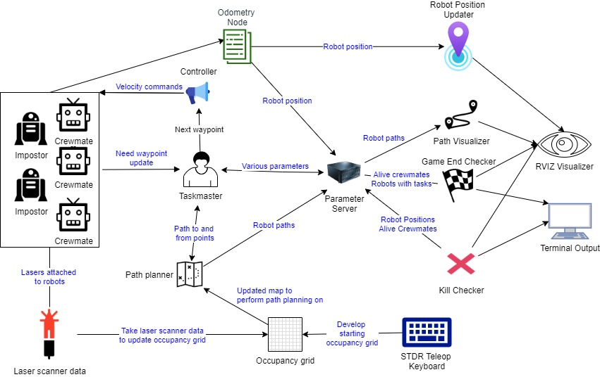

# ROSAmongUs (i.e Among Bots!)
Welcome to Among Bots!

The goal of Among Bots was to create a simulation of the hit multiplayer video game "Among Us" using simple robots in STDR Simulator. In this game, one large team of crewmates aims to complete a set number of tasks while a smaller team aims to sabotage and kill crewmates. The game ends when either all tasks are completed or no crewmates are left in the environment. The real game of "Among Us" involves more complex methods of play such as sabotage and voting, but our goal was to replicate the basic functionality of the game.

Curious to learn everything? [Check out our website!](https://www.notion.so/amongbots/Among-Bots-209a296c2b944559a398b47a704d8020)
## Run it!
To run everything you need to start up our project run the bash file:
```bash
source run.sh
```

## Launch Files
These launch files initialize the key aspects of our game: our robots, our map, our occupancy grid, our topics, and our RVIZ visualization!

| File            | Path                                                                        | What it does                                                                                                                                       |
|-----------------|-----------------------------------------------------------------------------|----------------------------------------------------------------------------------------------------------------------------------------------------|
| among_us.launch | ~/ros_workspaces/project/src/stdr_simulator/stdr_launchers/launch| Added to the stdr_launchers repository, this custom launch file initializes all of the parameters for each of our robots and our game logic. In addition, this launch files calls STDR to open The Skeld png map and initialize the first robot. From there, we spawn the rest of the robots through our spawn_robots.bash script                                                                                                                        |
| occupancy_grid_combined.launch   | ~/ros_workspaces/project/src/among_us/src | This launch file creates topics and frames for the robot lasers to publish LaserScan data to. Parameters for the occupancy grid are defaulted here along with one visualization topic to which all of the robots will publish to and the path planner will subscribe to.                                                                    |
| among_rviz.launch    | ~/ros_workspaces/project/src/stdr_simulator/stdr_launchers/launch | Launches RVIZ with our desired initial configuration for visuals.                                                                                   |

## Custom Python Scripts
These custom python scripts hold the core functionality of our game. 

| File            | Path                                                                        | What it does                                                                                                                                       |
|-----------------|-----------------------------------------------------------------------------|----------------------------------------------------------------------------------------------------------------------------------------------------|
| parameter_server.py | ~/ros_workspaces/project/src/among_us/src           | Creates a subscriber object to receive Odometry message from the robots to update robot position parameters.                               |
| robot_controller.py | ~/ros_workspaces/project/src/among_us/src            | Controls a robot from their current position to go to a target position as dictated by the taskmaster. |
| taskmaster.py | ~/ros_workspaces/project/src/among_us/src             |  Consistently assigns crewmates to their tasks and assigns impostors a crewmate to kill. This is where the A* algorithm is run, and individual waypoints are sent to each of the crewmates, which simplifies controller implementation|
| kill_checker.py | ~/ros_workspaces/project/src/among_us/src           | Continuously checks if an impostor is in close enough range to kill a crewmate. If so, the impostor kills the crewmate and the proper parameters are updated. |
| game_ending_checker.py | ~/ros_workspaces/project/src/among_us/src           | Continuously checks if crewmates completed all tasks or if impostors have killed all the crewmates. If crewmates complete all tasks before the impostors have a chance to kill all crewmates, then the crewmates win the game. Otherwise, the impostors win. |
| occupancy_grid_2d.py | ~/ros_workspaces/project/src/among_us/src           | Initialized by running mapping_node.py and controlling one robot using STDR Tele-op Keyboard and moving the robot through the map. As the game progresses, all robots will contribute to the occupancy grid as they move through the map. Path planning is performed on the continuously updating occupancy grid. |
| path_publisher.py | ~/ros_workspaces/project/src/among_us/src            | Continuously checks for the robot path parameter and publishes it to RVIZ for visualization purposes. |

## System Design
.


